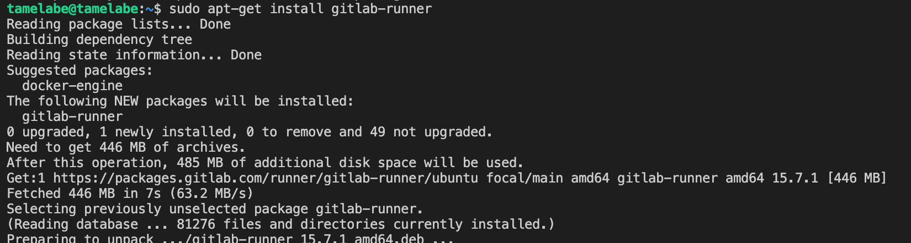
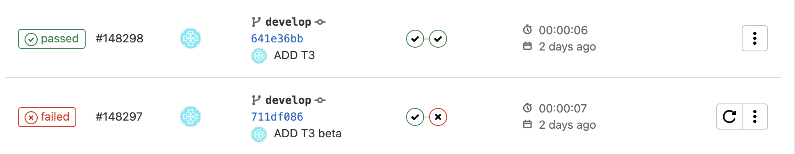
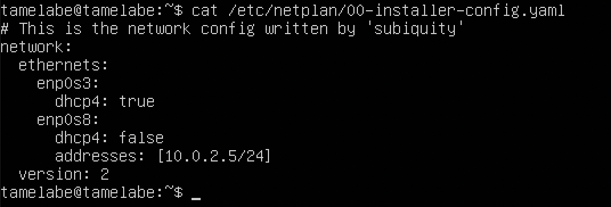
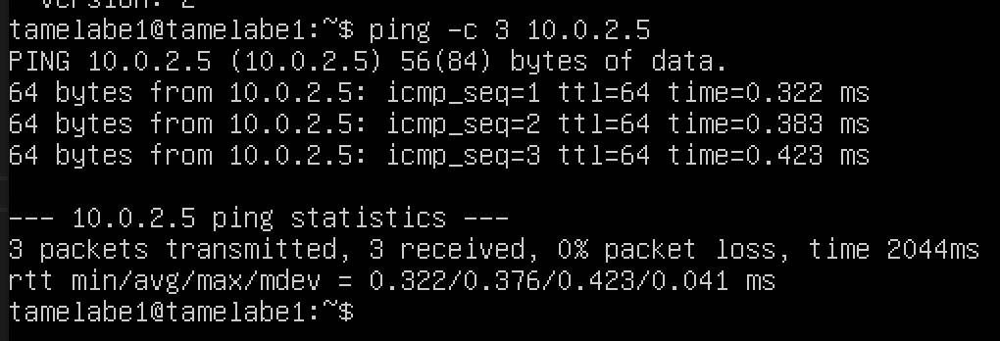
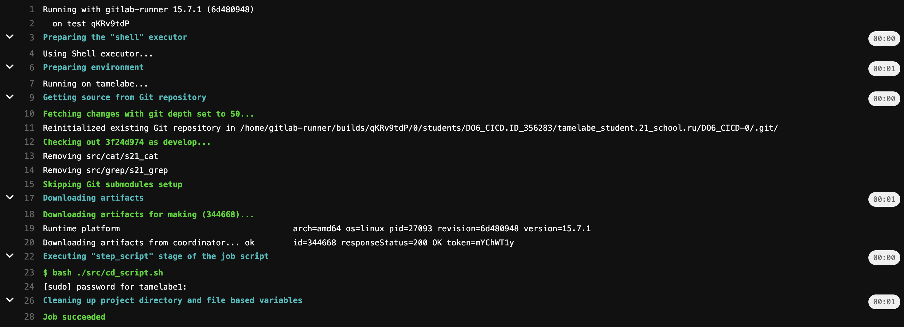

# Basic CI/CD

Development of a simple **CI/CD** for the *SimpleBashUtils* project. Building, testing, deployment.

## Part 1. Настройка gitlab-runner

Установка gitlab-runner

Регистрация gitlab-runner

## Part 2. Сборка

Создание пайплайна для сборки - gitlab-ci.yml

Статус

Работа стадии сборки

## Part 3. Тест кодстайла

Добавление стадии в пайплайн

Статус

Работа стадии кодстайла (fail/passed)

## Part 4. Интеграционные тесты

Добавление стадии в пайплайн

Добавление в скрипт с тестами выхода с кодом 1, чтобы зайейлить пайплайн

Статус

Работа стадии интеграционного тестирования (fail/passed)

## Part 5. Этап деплоя

Конфигурация сети для первой виртуальной машины

Пингование 2 виртуальных машин между собой

Далее создал ssh ключ для пользователя gitlab-runner и импортировал во вторую виртуалку через команду `ssh-copy-id`, чтобы не просил пароль при подкючении

Прописал в пайплайн стадию деплоя, в скрипте прописал импорт собранного файла во 2 виртуалку и перемещение в требуемую директорию:

Тестирование стадии:

В случае фейла (специально указал не тот файл в скрипте)

ДАМПЫ ВИРТУАЛОК сохранены здесь: [ссылка](https://drive.google.com/drive/folders/1iHQ_3LbIr3rnZ2zXqUO5_BGj5M0jcR3X?usp=share_link)

## Part 6. Дополнительно. Уведомления

Зарегистрировал бота, получил токен, затем нашел `chat_id`

Написал скрипт для постинга сообщений

Изменил `gitlab-ci.yml` для обработки зафейленного пайплайна

Уведомления в телеграм-боте:

Пайплайн:

Имя бота: `@tamelabe_cicd_bot`

