## Part 1. Настройка gitlab-runner

Установка gitlab-runner
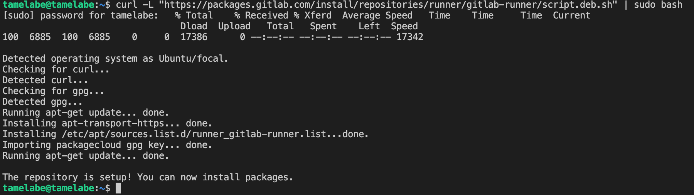
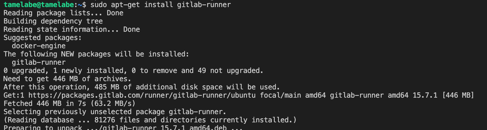
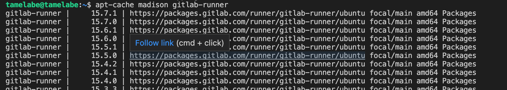
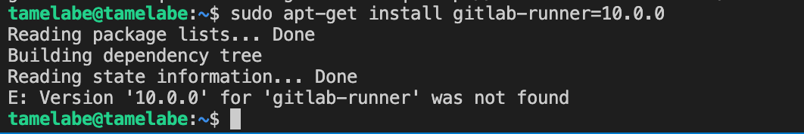

Регистрация gitlab-runner
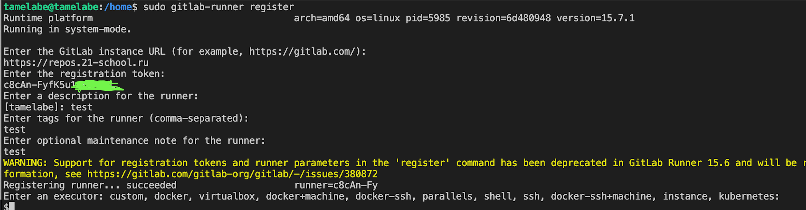

## Part 2. Сборка

Создание пайплайна для сборки - gitlab-ci.yml

Статус

Работа стадии сборки
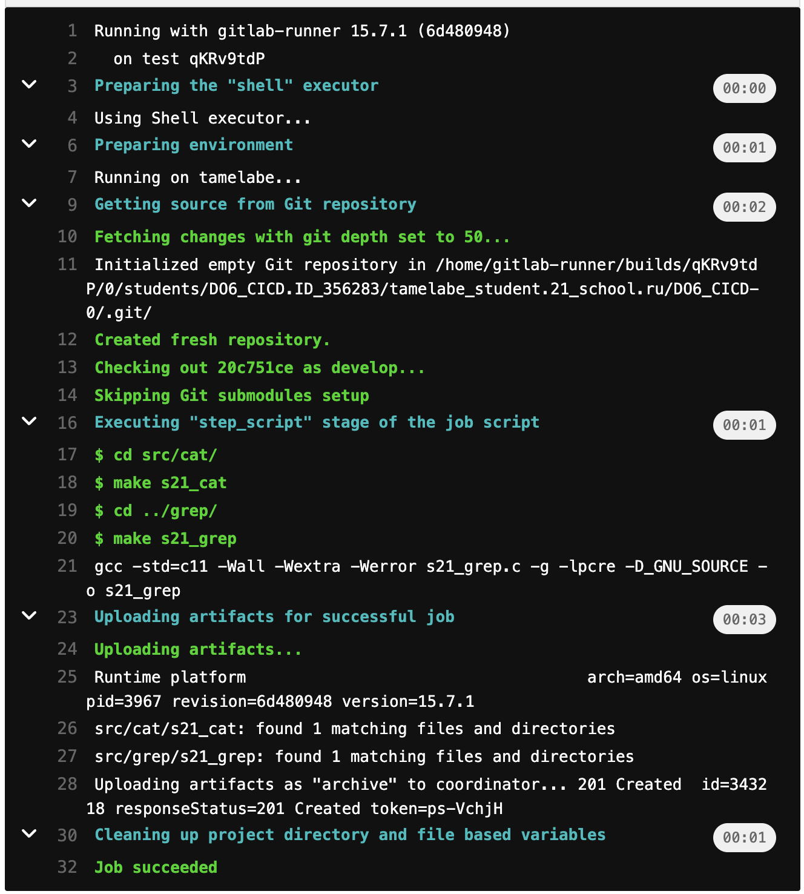

## Part 3. Тест кодстайла

Добавление стадии в пайплайн
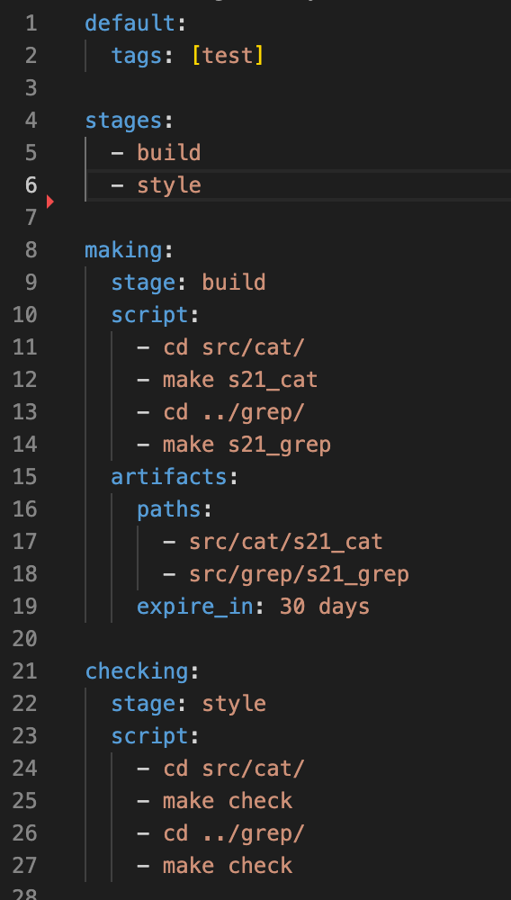

Статус
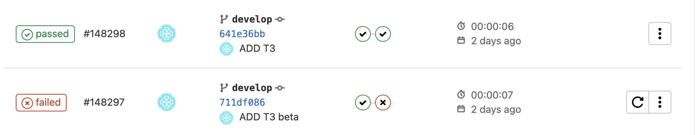

Работа стадии кодстайла (fail/passed)
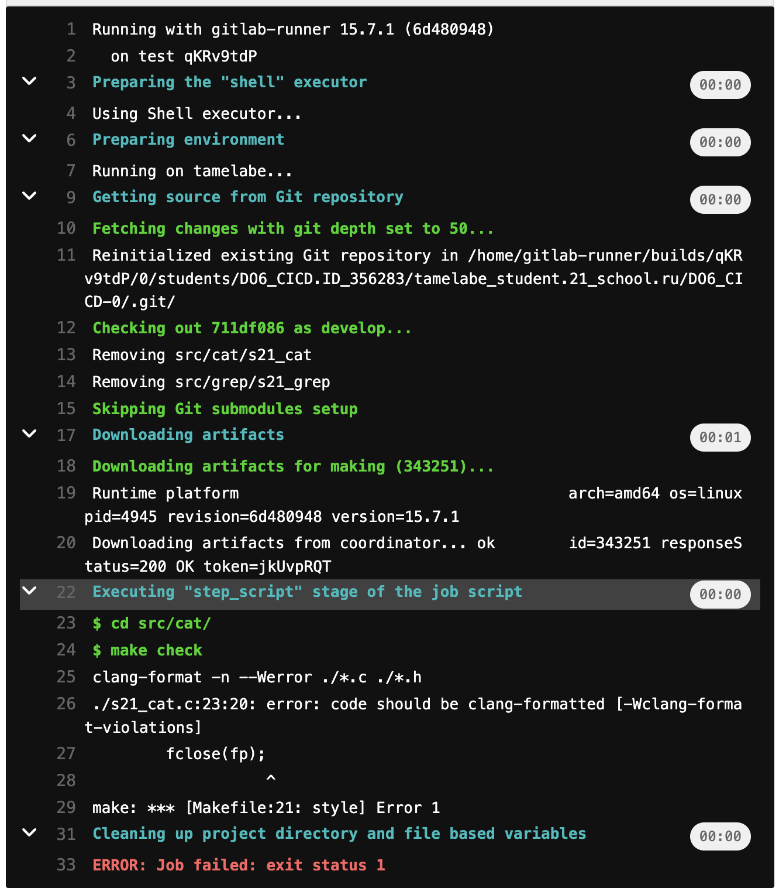
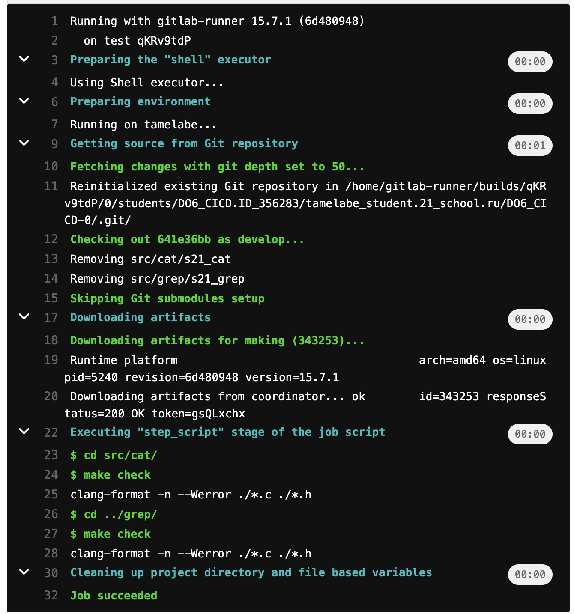

## Part 4. Интеграционные тесты

Добавление стадии в пайплайн
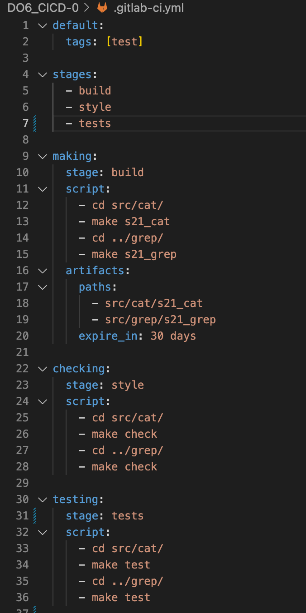

Добавление в скрипт с тестами выхода с кодом 1, чтобы зайейлить пайплайн
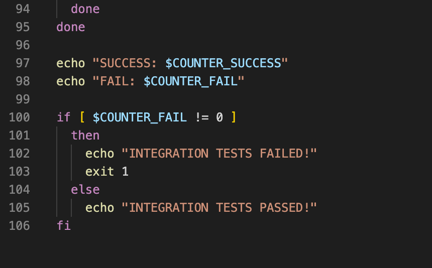

Статус
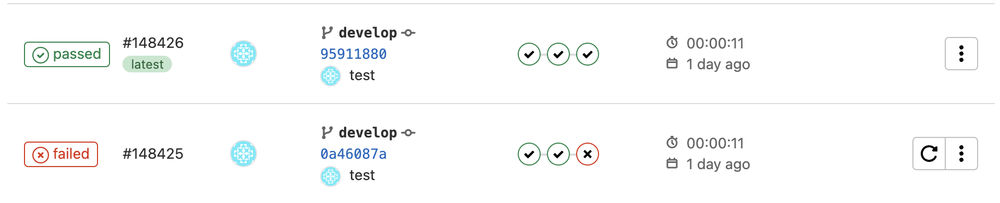

Работа стадии интеграционного тестирования (fail/passed)

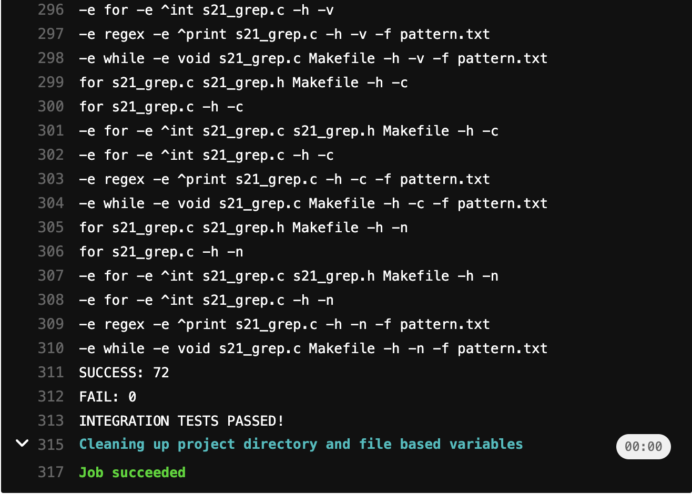

## Part 5. Этап деплоя

Конфигурация сети для первой виртуальной машины
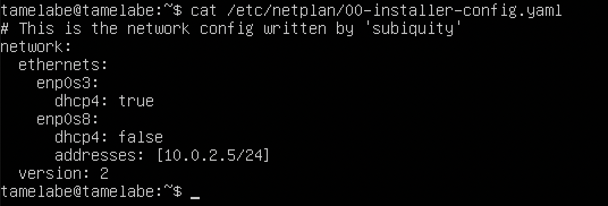

Пингование 2 виртуальных машин между собой
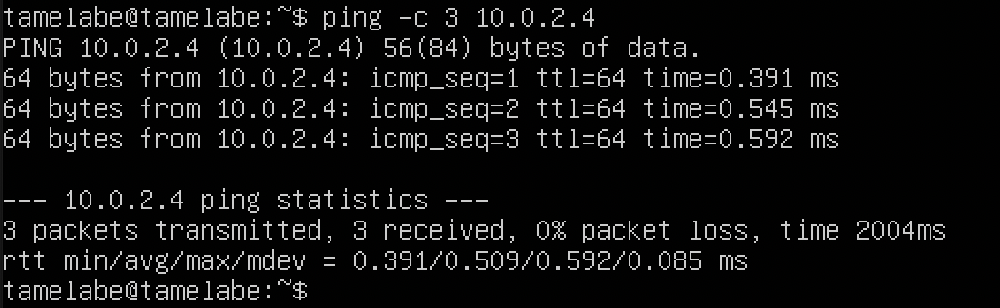
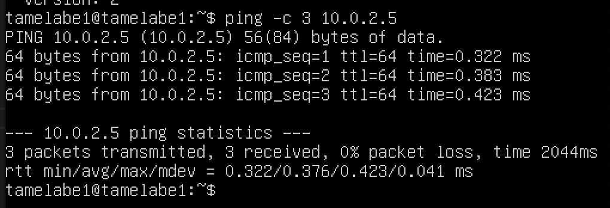

Далее создал ssh ключ для пользователя gitlab-runner и импортировал во вторую виртуалку через команду `ssh-copy-id`, чтобы не просил пароль при подкючении

Прописал в пайплайн стадию деплоя, в скрипте прописал импорт собранного файла во 2 виртуалку и перемещение в требуемую директорию:
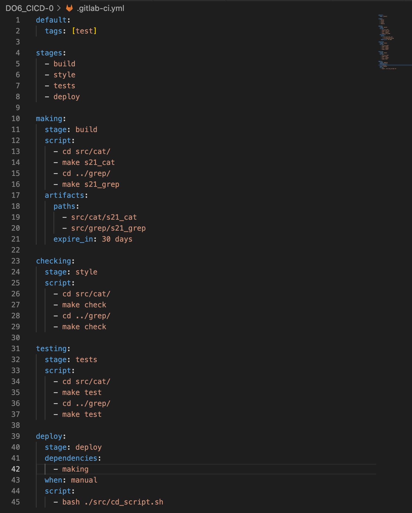
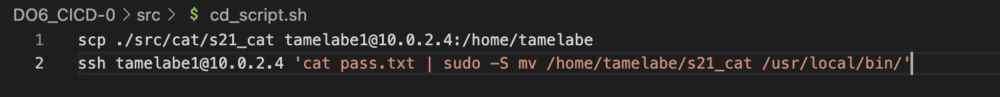

Тестирование стадии:
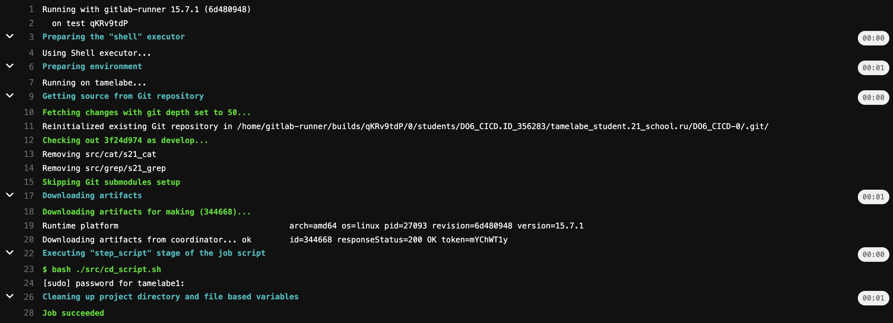

В случае фейла (специально указал не тот файл в скрипте)
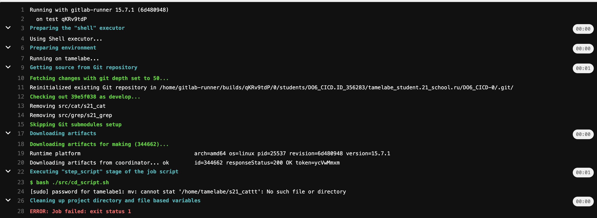

ДАМПЫ ВИРТУАЛОК сохранены здесь: [ссылка](https://drive.google.com/drive/folders/1iHQ_3LbIr3rnZ2zXqUO5_BGj5M0jcR3X?usp=share_link)

## Part 6. Дополнительно. Уведомления

