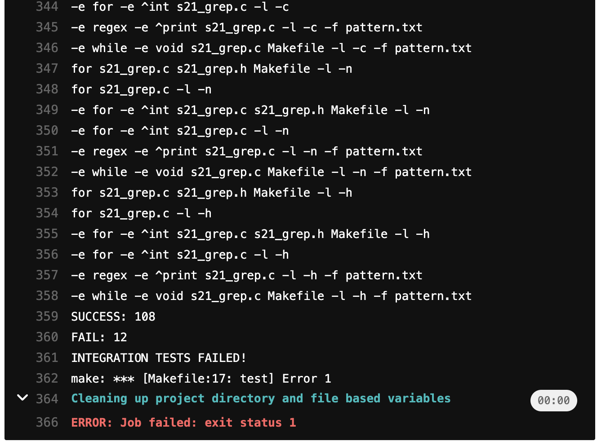

## Part 1. Настройка gitlab-runner

Установка gitlab-runner

Регистрация gitlab-runner

## Part 2. Сборка

Создание пайплайна для сборки - gitlab-ci.yml

Статус

Работа стадии сборки

## Part 3. Тест кодстайла

Добавление стадии в пайплайн

Статус

Работа стадии кодстайла (fail/passed)

## Part 4. Интеграционные тесты

Добавление стадии в пайплайн

Добавление в скрипт с тестами выхода с кодом 1, чтобы зайейлить пайплайн

Статус

Работа стадии интеграционного тестирования (fail/passed)

## Part 5. Этап деплоя

## Part 6. Дополнительно. Уведомления